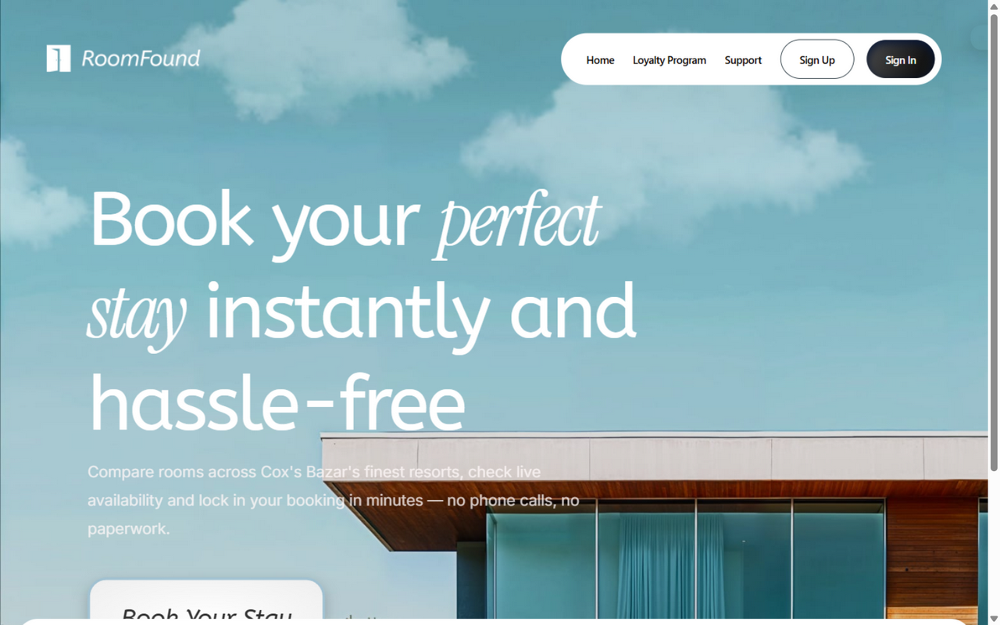
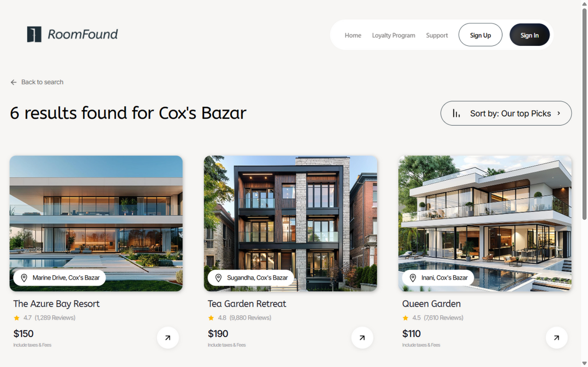
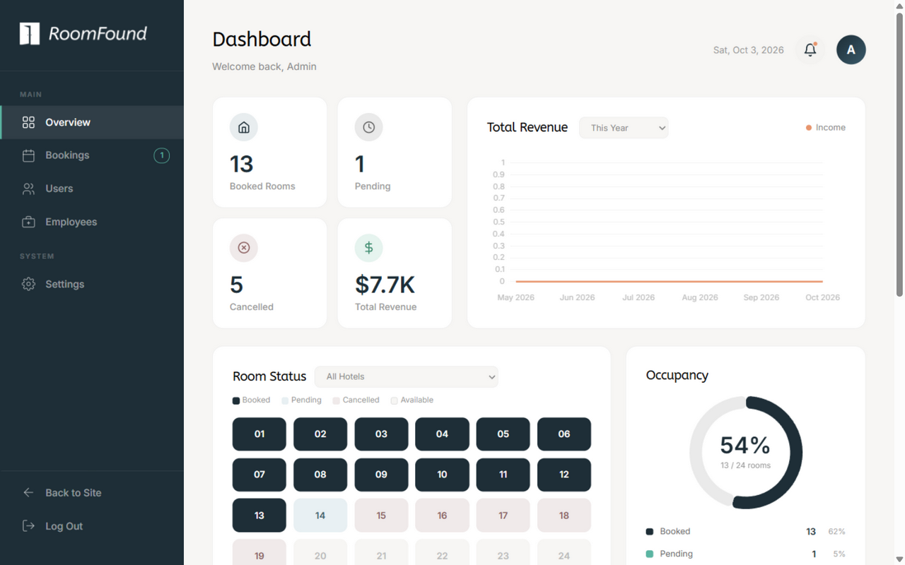
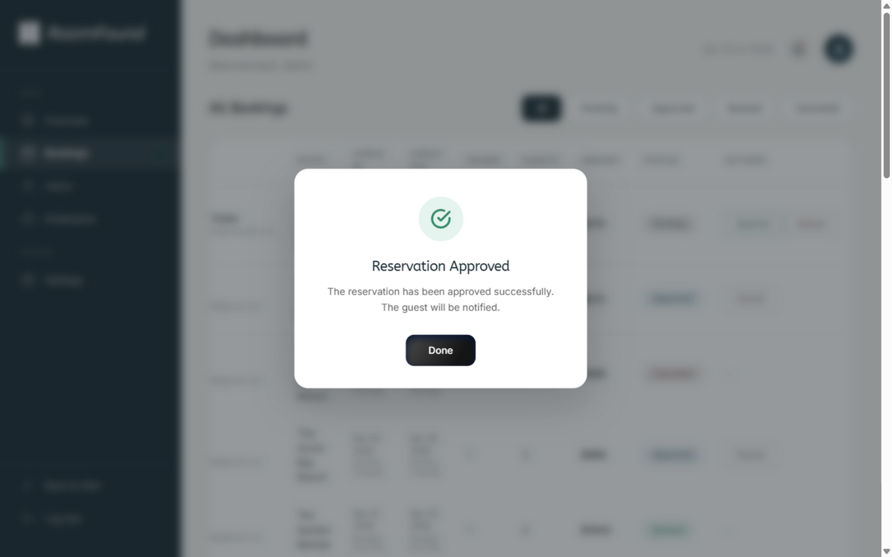
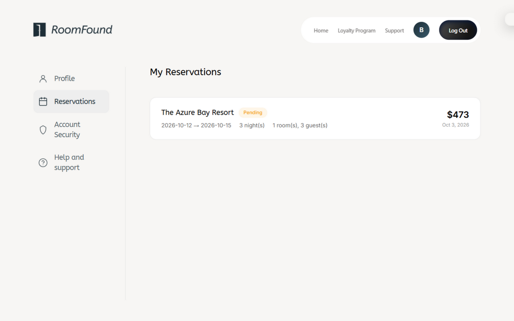
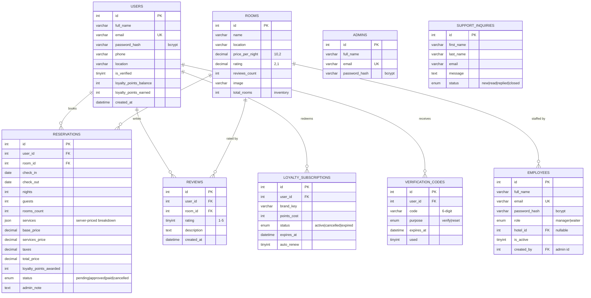

# 🏨 RoomFound — Hotel Reservation & Loyalty Management System


> A complete, production-style hotel reservation platform built from scratch with **pure PHP (no framework)** and **vanilla JavaScript (no framework)** — featuring a full booking engine with server-authoritative pricing, a date-aware room availability system, a 4-role access model, a tiered loyalty points economy, and live database-backed hotel reviews.

---

## 📑 Table of Contents

- [Screenshots](#-screenshots)
- [Architectural Highlights](#-architectural-highlights--innovations)
- [Role-Based Access Control](#-role-based-access-control--permission-matrix)
- [Complete Entity Relationship Diagram (ERD)](#-complete-entity-relationship-diagram-erd)
- [Technology Stack Matrix](#%EF%B8%8F-technology-stack-matrix)
- [Master API Catalog](#-master-api-catalog-37-endpoints)
- [Directory Structure & File Architecture](#%EF%B8%8F-directory-structure--file-architecture)
- [Security Model — How Nothing Can Be Spoofed](#%EF%B8%8F-security-model--how-nothing-can-be-spoofed)
- [The Loyalty Points Economy](#-the-loyalty-points-economy)
- [Environment Variables Reference](#%EF%B8%8F-environment-variables-reference)
- [Installation & Getting Started](#%F0%9F%9A%80-installation--getting-started)
- [Default Credentials](#-default-credentials)
- [License & Acknowledgements](#%EF%B8%8F-license--acknowledgements)

---

## 📸 Screenshots

| Homepage (Desktop) | Search Results |
| :---: | :---: |
|  |  |

| Admin Dashboard (Live Charts & Room Status) | Admin Approval Flow |
| :---: | :---: |
|  |  |

| Guest Booking Panel | Fully Responsive with Hamburger Nav |
| :---: | :---: |
|  |  |

---

## 🌟 Architectural Highlights & Innovations

This project was built to behave like a real production system, not a demo. Every design decision below was made to close a specific class of vulnerability or correctness bug.

### 1. Server-Authoritative Pricing Engine 💰
The client never decides what anything costs. Every price is recomputed from the database at booking time:

```
base_price      = rooms.price_per_night × rooms_count × nights
services_price  = Σ(catalog service prices) + (room-option upgrade × rooms_count × nights)
taxes           = 5% of (base + services)
total_price     = base + services + taxes
```

The service catalog (spa, pool, airport pickup…) and room-option upgrades (King +$35/night, Deluxe Suite +$65/night…) are **defined in PHP**, not JavaScript. A tampered request can change *what* you ask for — never *what you pay*.

### 2. Date-Aware Availability with Row Locking 🔒
Availability is computed by **date-range overlap**, not naive counting:

```sql
-- A stay occupies its room from check-in (inclusive) to check-out (exclusive),
-- so same-day turnover between two guests is allowed:
SELECT COALESCE(SUM(rooms_count), 0) FROM reservations
WHERE room_id = ? AND status IN ('pending','approved','paid')
  AND check_in < :check_out AND check_out > :check_in
```

The booking endpoint wraps the whole operation in a transaction with `SELECT … FOR UPDATE` on the hotel row, so **two simultaneous bookings can never oversell the same room**. Availability is shared by one implementation (`getBookedRooms()`) across the public site, the admin panel, and the manager dashboard — three views, one source of truth.

### 3. Separate Identity Spaces with Hard Role Guards 👥
Admins, employees (manager/waiter), and guests live in **three different tables with independent auto-increment IDs**. Because `admins.id = 1` and `users.id = 1` are different people, every guest-only endpoint is guarded by a `requireUserRole()` gate — an admin opening the profile API is refused with `403` instead of silently reading a stranger's data.

### 4. Centralized Loyalty Point Transitions 🎯
Loyalty points can be earned or revoked from *two* places (guest payment, admin status changes). Both route through a single transactional handler `setReservationStatus()` in `config.php`:

- Reservation becomes `paid` → `floor(total_price × 0.5)` points awarded **once** (idempotent via `loyalty_points_awarded`).
- Reservation *leaves* `paid` (cancelled/reopened) → awarded points are revoked atomically.

No code path exists where points can be double-awarded, kept after cancellation, or minted out of thin air.

### 5. Honest Reviews, Not localStorage 🗣️
Hotel reviews are persisted in a `reviews` table (one per user per hotel, upsert on resubmit), rendered server-side from the API, and the displayed rating transitions from the seed value to the real computed average as soon as real reviews exist.

### 6. Real-World Resilience 🧨
- **Offline demo mode**: if SMTP is unreachable, signup and password reset still complete — the verification code surfaces in the UI (`DEV_FALLBACK_SHOW_CODE` in `api/mail_config.php`).
- **Brute-force throttling** on login (10 failures / 5 min) and email verification (6 wrong tries invalidates the code).
- **Rate-limited** support inquiries (5 per 10 min) and reset-code requests (1 per 60 s).

---

## 🔐 Role-Based Access Control & Permission Matrix

| Capability | 🧑‍💼 Guest | 🛎️ Waiter | 📋 Manager | 👑 Admin |
|---|:---:|:---:|:---:|:---:|
| Browse & search hotels | ✅ | ✅ | ✅ | ✅ |
| Create reservation | ✅ | ❌ | ❌ | ❌ |
| Pay for reservation | ✅ | ❌ | ❌ | ❌ |
| Earn / redeem loyalty points | ✅ | ❌ | ❌ | ❌ |
| Write hotel review | ✅ | ❌ | ❌ | ❌ |
| View hotel bookings (own hotel) | ❌ | ✅ | ✅ | ❌ |
| Hotel overview & occupancy stats | ❌ | ❌ | ✅ | ❌ |
| Approve / cancel any reservation | ❌ | ❌ | ❌ | ✅ |
| Manage employees (create/toggle/remove) | ❌ | ❌ | ❌ | ✅ |
| Manage hotels (add/edit/delete) | ❌ | ❌ | ❌ | ✅ |
| Support inquiry inbox | ❌ | ❌ | ❌ | ✅ |
| Revenue analytics & charts | ❌ | ❌ | ✅ (own hotel) | ✅ (all hotels) |

---

## 📊 Complete Entity Relationship Diagram (ERD)



**Nine tables**, four storage engines concepts: InnoDB for transactional data with real foreign keys (`ON DELETE CASCADE` for user-owned data, `ON DELETE SET NULL` for hotel assignments), and indexed hot paths (`idx_reservations_room_dates` for the overlap query, `idx_reservations_status` for dashboard filters).

---

## 🛠️ Technology Stack Matrix

| Layer | Technology | Why |
|---|---|---|
| Backend | **PHP 8.0** (PDO, prepared statements) | Zero-framework — every request, guard, and transaction is explicit and auditable |
| Database | **MySQL / MariaDB** (InnoDB) | Real FKs, row locks, and crash-safe transactions |
| Frontend | **Vanilla JavaScript** (IIFE modules) | No build-tool lock-in for app logic; fetch API + server sessions |
| Styling | **Tailwind CSS 4** (CLI build) + hand-written component CSS | Utility-first pages + custom design system (`input.css`) |
| Charts | **Chart.js 4** | Revenue line chart, occupancy doughnut, per-hotel room grid |
| Email | **PHPMailer 6 + Gmail SMTP** | Verification codes, password-reset codes, support notifications |
| Passwords | **bcrypt** via `password_hash()` | Industry-standard hashing, per-user salts |
| Server | **Apache (XAMPP)** | `.htaccess`: cache headers, dotfile/composer blocking |

---

## 📚 Master API Catalog (37 Endpoints)

All endpoints live in `api/` and speak **JSON** (`Content-Type: application/json`). Responses share one envelope:

```json
{ "success": true, "message": "…", "…data": {} }
```

### 1. Authentication & Sessions (6)

| # | Method | Endpoint | Auth | Description |
|---|---|---|---|---|
| 1 | `POST` | `api/login.php` | — | Login. Checks `admins` → `employees` → `users` in order; sets role-scoped session; brute-force throttled (10 fails / 5 min); regenerates session ID |
| 2 | `POST` | `api/signup.php` | — | Register guest. Sends 6-digit verification code via Gmail SMTP; offline demo fallback included |
| 3 | `POST` | `api/verify.php` | pending session | Verify email (`action: "verify"`) or resend code (`action: "resend"`, 60 s cooldown); 6 wrong tries invalidates the code |
| 4 | `POST` | `api/forgot_password.php` | — | `action: "request"` sends reset code (anti-enumeration: same response for unknown emails); `action: "reset"` verifies code + sets new bcrypt password |
| 5 | `POST` | `api/change_password.php` | guest | Change password (requires current password) |
| 6 | `POST` | `api/logout.php` | any | Destroys session, clears cookie |

### 2. Session Introspection (1)

| # | Method | Endpoint | Auth | Description |
|---|---|---|---|---|
| 7 | `GET` | `api/session.php` | any | Returns current user `{name, email, role, hotel_id?, loyalty?}` — drives all navbar/dashboard state |

### 3. Hotels & Availability (2)

| # | Method | Endpoint | Auth | Description |
|---|---|---|---|---|
| 8 | `GET` | `api/availability.php?room_id&check_in&check_out` | — | Date-overlap availability for a hotel: `{total_rooms, booked, available}` |
| 9 | `GET` | `api/reviews.php?room_id` | — | Reviews + computed average (real reviews take over from the seed rating) |

### 4. Reservations & Payment (4)

| # | Method | Endpoint | Auth | Description |
|---|---|---|---|---|
| 10 | `GET` | `api/reservations.php` | guest | List own reservations with full price breakdown |
| 11 | `POST` | `api/reservations.php` | guest | **Book.** Validates dates/counts, `FOR UPDATE` locks the hotel row, recomputes all prices server-side, checks date-overlap capacity |
| 12 | `POST` | `api/pay.php` | guest | Pay an `approved` reservation → status `paid` + loyalty points awarded (transactional) |
| 13 | `POST` | `api/reviews.php` | guest | Create/update own review `{room_id, rating 1-5, description}` |

### 5. Loyalty Program (3)

| # | Method | Endpoint | Auth | Description |
|---|---|---|---|---|
| 14 | `GET` | `api/loyalty.php` | guest | Points balance, tier (Silver/Gold/Platinum), progress meters, unified points history (earned via bookings + spent on subscriptions) |
| 15 | `GET` | `api/subscriptions.php` | guest | Cafe subscription catalog (tier-aware offers) + active subscriptions; auto-expires stale ones |
| 16 | `POST` | `api/subscriptions.php` | guest | `action: "redeem"` (600 pts, transactional with `FOR UPDATE`, double-redeem blocked) or `action: "cancel"` |

### 6. Profile (2)

| # | Method | Endpoint | Auth | Description |
|---|---|---|---|---|
| 17 | `GET` | `api/profile.php` | guest | Read own profile (first/last name split, email, phone, location) |
| 18 | `POST` | `api/profile.php` | guest | Update name/phone/location (length-validated) |

### 7. Public Support (1)

| # | Method | Endpoint | Auth | Description |
|---|---|---|---|---|
| 19 | `POST` | `api/support.php` | — | Submit inquiry (validation + 5/10 min rate limit) + email notification to support |

### 8. Admin — Read (6)

| # | Method | Endpoint | Auth | Description |
|---|---|---|---|---|
| 20 | `GET` | `api/admin.php?action=stats` | admin | Dashboard totals: users, reservations, revenue (all-time/monthly/7-day series), pending count, **date-aware occupied rooms**, total inventory |
| 21 | `GET` | `api/admin.php?action=reservations[&status]` | admin | All reservations joined with guest identity |
| 22 | `GET` | `api/admin.php?action=hotels` | admin | Hotel inventory list |
| 23 | `GET` | `api/admin.php?action=hotel_stats&hotel_id` | admin | Per-hotel breakdown: status counts, revenue, occupied-now vs `total_rooms` (not a hardcoded 24) |
| 24 | `GET` | `api/admin.php?action=users` | admin | All guests + reservation counts |
| 25 | `GET` | `api/admin.php?action=employees` / `action=support` | admin | Employee roster with hotel names / support inbox |

### 9. Admin — Write (7)

| # | Method | Endpoint | Auth | Description |
|---|---|---|---|---|
| 26 | `POST` | `api/admin.php` `action=update_status` | admin | Approve/cancel/reopen reservations → routed through `setReservationStatus()` so loyalty points stay consistent |
| 27 | `POST` | `api/admin.php` `action=create_employee` | admin | Create manager/waiter bound to a hotel (bcrypt, duplicate check) |
| 28 | `POST` | `api/admin.php` `action=toggle_employee` | admin | Activate/deactivate (deactivated logins are refused) |
| 29 | `POST` | `api/admin.php` `action=delete_employee` | admin | Remove employee |
| 30 | `POST` | `api/admin.php` `action=save_hotel` | admin | Create or update a hotel (full validation) |
| 31 | `POST` | `api/admin.php` `action=delete_hotel` | admin | Delete hotel — **refused if bookings exist** (protects history) |
| 32 | `POST` | `api/admin.php` `action=update_support_status` | admin | Mark inquiry `read/replied/closed` |

### 10. Employee Dashboards (3)

| # | Method | Endpoint | Auth | Description |
|---|---|---|---|---|
| 33 | `GET` | `api/employee.php?action=bookings[&status][&search]` | waiter | Own-hotel bookings + status summary (scoped by `hotel_id` server-side) |
| 34 | `GET` | `api/employee.php?action=overview` | manager | Hotel KPIs: today's check-ins/check-outs, current occupancy, pending, recent arrivals |
| 35 | `GET` | `api/employee.php?action=hotel_rooms&hotel_id` | manager | Room-level breakdown (hotel_id must match the employee's assignment) |

### 11. System (2)

| # | Method | Endpoint | Auth | Description |
|---|---|---|---|---|
| 36 | `GET` | `api/migrate.php` | — | Idempotent schema migration + seed (hotels, admin, indexes, backfills) — safe to re-run |
| 37 | — | `api/config.php` | — | Shared kernel: DB connection, session hardening, `getBookedRooms()`, `setReservationStatus()`, `requireUserRole()` |

---

## 🗂️ Directory Structure & File Architecture

```
Hotel Management/
├── api/                          # ─── BACKEND: one file per resource, JSON-only ───
│   ├── config.php                # Kernel: DB PDO, session hardening, shared helpers
│   ├── login.php                 # Multi-table login (admin → employee → user)
│   ├── signup.php                # Registration + verification code pipeline
│   ├── verify.php                # Code verification / resend (purpose-scoped)
│   ├── forgot_password.php       # Password reset (request + reset actions)
│   ├── change_password.php       # Authenticated password change
│   ├── logout.php                # Session teardown
│   ├── session.php               # Session introspection for the UI
│   ├── availability.php          # Date-overlap availability
│   ├── reservations.php          # Booking engine (server-priced, row-locked)
│   ├── pay.php                   # Payment simulation + points award
│   ├── reviews.php               # Hotel reviews (public read, guest write)
│   ├── loyalty.php               # Points, tiers, unified history
│   ├── subscriptions.php         # Cafe plans: catalog / redeem / cancel
│   ├── profile.php               # Guest profile CRUD
│   ├── support.php               # Public inquiry intake
│   ├── admin.php                 # Full admin surface (13 actions, one guard)
│   ├── employee.php              # Manager/waiter dashboards (hotel-scoped)
│   ├── migrate.php               # Idempotent migrations + seed data
│   ├── send_mail.php             # PHPMailer: verification + reset emails
│   ├── mail_config.example.php   # ← copy to mail_config.php (git-ignored)
│   └── mail_config.php           # Your real credentials (NEVER committed)
│
├── src/                          # ─── FRONTEND: one page per screen ───
│   ├── index.html                # Landing + search bar + auth modals
│   ├── rooms.html                # Search results (grid + live sorting)
│   ├── hotel.html                # Hotel detail: gallery, services, room options, reviews, booking
│   ├── loyalty.html              # Tier slider, points history, redeem store
│   ├── profile.html              # Guest profile, reservations, security
│   ├── support.html              # Contact form
│   ├── admin.html                # Admin SPA-style dashboard (6 sections)
│   ├── manager.html              # Manager dashboard
│   ├── waiter.html               # Waiter booking board
│   ├── js/ modules: auth.js · navbar-auth.js · mobile-nav.js · search-bar.js
│   │   · hotel.js · rooms.js · loyalty.js · profile.js · support.js
│   │   · admin.js · modal.js (design-system dialogs)
│   ├── input.css                 # Tailwind source + design system + responsive rules
│   ├── output.css                # Compiled (npm run build)
│   └── img/                      # Compressed assets (~2 MB total, was ~50 MB)
│
├── database/
│   └── hotel_management.sql      # Full schema + seed data (no credentials)
├── docs/screenshots/             # App screenshots used by this README
├── .htaccess                     # Cache policy + blocks composer/dotfiles over HTTP
├── composer.json                 # PHP dependency manifest (PHPMailer)
├── package.json                  # Tailwind build scripts
└── LICENSE                       # MIT
```

**Backend convention:** every API file is self-contained — guard → validate → (transact) → `jsonResponse()`. No routing framework, no magic; the request-to-response path is always readable top to bottom.

**Frontend convention:** each page owns exactly one JS module; shared behavior (auth modals, design-system dialogs, mobile nav) lives in reusable modules. Session state is server-driven — the UI never *assumes* a login, it asks `session.php`.

---

## 🛡️ Security Model — How Nothing Can Be Spoofed

| Threat | Defense |
|---|---|
| Price tampering | All pricing recomputed server-side from DB; client totals are display-only |
| Overbooking race | `SELECT … FOR UPDATE` on the hotel row + capacity check inside the transaction |
| Password theft | bcrypt hashes; plain passwords never stored, logged, or returned |
| Session hijacking | `session_regenerate_id(true)` on every privilege change; httponly + SameSite=Lax cookies |
| Brute force | Login throttle (10/5 min); verification codes die after 6 wrong tries; reset codes after 10 |
| Code guessing | 6-digit codes, 10-minute expiry, single use, `hash_equals()` timing-safe compare, purpose-scoped (`verify` vs `reset`) |
| ID-space abuse | Role guards: admins/employees are structurally locked out of guest endpoints (403) |
| Privilege escalation | Employee endpoints scope every query by the session's `hotel_id`; role checked server-side, never from the client |
| SQL injection | 100% prepared statements — zero string-interpolated queries |
| XSS | Every dynamic value in dashboards is HTML-escaped (`escapeHtml` / `escHtml`); no raw HTML from user data |
| Email enumeration | Password-reset responds identically whether or not the email exists |
| Spam | Support inquiries rate-limited per session |
| Credential leakage | Mail credentials live in a git-ignored file; the SQL seed contains no passwords; `.htaccess` blocks tooling files over HTTP |
| CSRF | JSON-only endpoints (unbrowsable cross-site content type) + SameSite=Lax cookies |

---

## 💰 The Loyalty Points Economy

```
Spend $100  →  earn 50 points  (0.5 points per $1, floor)

┌─────────┬───────────────┬────────────────────────────────────┐
│ Tier    │ Lifetime earn │ Perk                               │
├─────────┼───────────────┼────────────────────────────────────┤
│ Silver  │ 0 – 599       │ —                                  │
│ Gold    │ 600 – 1499    │ 12% off all meals                  │
│ Platinum│ 1500+         │ 25% off meals + priority service   │
└─────────┴───────────────┴────────────────────────────────────┘

Redeem: 600 points → 1-month cafe subscription (Crystal Cup /
Coffee House / Java Cafe) with tier-bonus offers baked in.
```

Points are awarded when a booking is **paid**, revoked if it later **leaves paid**, and spent atomically on subscriptions — every movement is journaled in the reservation (`loyalty_points_awarded`) and surfaced as a unified history feed on the loyalty page.

---

## ⚙️ Environment Variables Reference

There is deliberately **no `.env` parser** — configuration lives in two auditable files:

### `api/config.php` (committed — local-dev defaults)

| Constant | Default | Meaning |
|---|---|---|
| `DB_HOST` | `localhost` | Database host |
| `DB_NAME` | `hotel_management` | Database name |
| `DB_USER` | `root` | Database user (XAMPP default) |
| `DB_PASS` | *(empty)* | Database password (XAMPP default) |
| `VERIFICATION_CODE_EXPIRY_MINUTES` | `10` | Code lifetime |
| `SMTP_FROM_NAME` | `Hotel Management` | Email display name |

### `api/mail_config.php` (NOT committed — create from the example)

| Constant | Meaning |
|---|---|
| `GMAIL_ADDRESS` | Your Gmail address for sending |
| `GMAIL_APP_PASSWORD` | Gmail **App Password** (16 chars) — never a login password |
| `DEV_FALLBACK_SHOW_CODE` | `true` = show verification code on screen when SMTP is unreachable (demo mode) |

---

## 🚀 Installation & Getting Started

### 1. Prerequisites

- **XAMPP** (PHP 8.0+, Apache, MySQL/MariaDB) — [apachefriends.org](https://www.apachefriends.org/)
- **Composer** — [getcomposer.org](https://getcomposer.org/)
- **Node.js 18+** — only for rebuilding Tailwind CSS

### 2. Clone & Install

```bash
git clone https://github.com/supta69k/roomfound-hotel-management-system.git
cd roomfound-hotel-management-system

# PHP dependencies (PHPMailer)
composer install

# Frontend dependencies + build CSS (only if you change styles)
npm install
npm run build
```

Place the project inside XAMPP's web root (or clone directly there):

```bash
# XAMPP on Windows
C:\xampp\htdocs\
# this project's dev location
E:\xampp2\htdocs\Hotel Management\
```

### 3. Configure Mail

```bash
cp api/mail_config.example.php api/mail_config.php
# then edit api/mail_config.php with your Gmail + App Password
```

> **Why?** The real `mail_config.php` holds your Gmail App Password and is git-ignored — it can never be committed. Without it, email verification will not send (unless demo mode is on).

### 4. Database Migration & Seeding

Start Apache + MySQL from the XAMPP Control Panel, then:

```bash
# Option A — import the schema, then run the migration (creates admin + hotels + indexes)
mysql -u root < database/hotel_management.sql        # or import via phpMyAdmin
http://localhost/Hotel%20Management/api/migrate.php  # open once in the browser

# Option B — just open migrate.php: it creates the full schema itself
http://localhost/Hotel%20Management/api/migrate.php
```

`migrate.php` is **idempotent** — safe to re-run any time; it adds tables/columns/indexes only when missing and seeds the six Cox's Bazar hotels and the default admin.

### 5. Run

Open **http://localhost/Hotel%20Management/src/index.html**

Log in as the seeded admin → `admin@roomfound.com` / `Admin@123` → **change this password immediately** in any real deployment (the SQL seed intentionally contains no credentials — the account is created by `migrate.php`).

### 6. Suggested Demo Walkthrough

1. Browse as guest → search Cox's Bazar → pick dates → open a hotel.
2. Sign up (verification code arrives by email — or on-screen in demo mode).
3. Reserve with services + room upgrade → admin approves in the panel.
4. Pay from *My Reservations* → watch loyalty points land.
5. Redeem a cafe subscription on the Loyalty page → cancel the booking as admin → points are revoked.
6. Leave a review → it appears for everyone, and the hotel's average updates.

---

## 🔑 Default Credentials

| Role | Email | Password | Notes |
|---|---|---|---|
| Admin | `admin@roomfound.com` | `Admin@123` | Created by `migrate.php` — **change after first login** |

Employees are created by the admin panel (no defaults). Guests self-register.

---

## 🗺️ Known Scope Boundaries (honest engineering)

- **Payments are simulated** — `pay.php` models the state machine and loyalty effects of a payment gateway without charging anything.
- **Search covers Cox's Bazar** — the six seeded hotels; other locations show a "coming soon" notice.
- **PHP is required** — this is a server-rendered app; static hosts (GitHub Pages) can serve the UI but not the API.

---

## 🛡️ License & Acknowledgements

Released under the [MIT License](LICENSE).

Built with [Tailwind CSS](https://tailwindcss.com/), [Chart.js](https://www.chartjs.org/), [PHPMailer](https://github.com/PHPMailer/PHPMailer), and fonts by Google Fonts (ABeeZee, Instrument Serif, Inter).

---

<div align="center">

**⭐ If this project helped you understand full-stack engineering without frameworks, a star is appreciated!**

</div>
